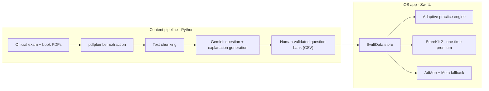

# Bliv Klar 🇩🇰

**The modern way to pass the Danish citizenship exam (indfødsretsprøven).** A shipped, monetized iOS app backed by an AI-assisted content pipeline.

## What it does
- Every official exam from 2018 onward, kept current as new exams are released
- **Adaptive practice** that remembers your mistakes and drills your weak spots
- Offline-first, no subscription — a single one-time premium unlock

## Architecture

## Engineering highlights
- **AI content pipeline**: extracts official citizenship/residence material from PDFs (`pdfplumber`), chunks it, and uses **Google Gemini** to generate exam-style questions and explanations — finalized into a human-validated question bank rather than trusted blindly.
- **Adaptive learning** that surfaces previously-missed questions more often.
- Production iOS: SwiftUI + **SwiftData**, **StoreKit 2** one-time purchase, AdMob with **Meta Audience Network fallback**, privacy-first TelemetryDeck analytics.
- Full release operations: localized Danish/English content and promo-code generation.

## Tech stack
| Layer | Technologies |
|---|---|
| App | SwiftUI, SwiftData, StoreKit 2 (iOS 18+) |
| Content | Python, pdfplumber, Google Gemini |
| Monetization / analytics | AdMob, Meta Audience Network, TelemetryDeck |

## Screenshots
_Add app screenshots to `docs/screenshots/`._

---
© 2026 Alen Trgovcevic · AT Productions (CVR 46159640). Source code is private; this repository is a public architecture overview.
